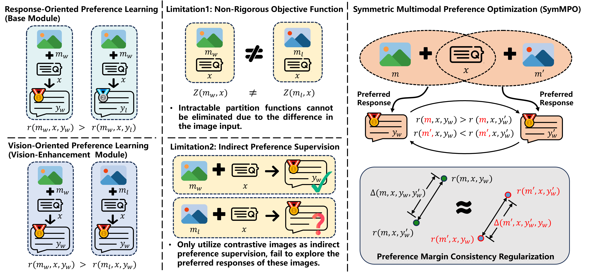

# Mitigating Hallucination Through Theory-Consistent Symmetric Multimodal Preference Optimization

<div align="center" style="font-size: 15pt">


<a href='https://arxiv.org/abs/2411.17265'></a>
<a href='https://huggingface.co/datasets/Tanh01/SymMPO_Dataset'></a>
<a href='https://huggingface.co/Tanh01/SymMPO_similar'></a>

</div>

<table align="center">
    <p align="center">
      
    </p>
</table>


## Install

Our codebase requires CUDA version 11.8.

```bash
conda create -n symmpo python=3.10 -y
conda activate symmpo
pip install -r requirements.txt
```

## Train

**1. Prepare data**

We provide demo data in this repository for quick setup and testing. The full training dataset will be released after the double-blind review process.

**2. Download the pretrained models**

Download LLaVA model from [liuhaotian/llava-v1.5-7b](https://huggingface.co/liuhaotian/llava-v1.5-7b).

Download the vision tower model (CLIP) from [openai/clip-vit-large-patch14-336](https://huggingface.co/openai/clip-vit-large-patch14-336).

**3. Modify model paths**

To integrate the downloaded models, update the following paths in the code:

1. Set the path to the LLaVA model in the 3rd line of `run.sh`.
2. Set the path to the CLIP model:
   - In the 4th line of `run.sh`.
   - In the 6th line of `llava/model/multimodal_encoder/builder.py`.
   - In the 14th line of `llava/model/multimodal_encoder/clip_encoder.py`.

**4. Start Training**

Run the following command to start training.

```bash
bash run.sh
```

## Evaluation

During evaluation, HallusionBench/object-halbench/mmhal-bench need to be assessed using Deepseek-V3/GPT-3.5/GPT-4.

### HallusionBench

1. Download [Questions and Annotations](https://github.com/tianyi-lab/HallusionBench/blob/main/HallusionBench.json) and [Figures](https://drive.google.com/file/d/1eeO1i0G9BSZTE1yd5XeFwmrbe1hwyf_0/view?usp=sharing).
2. Eval model.

```bash
python script/eval/eval_hallusion.sh [ckpt_path] [base_path if use lora ckpt else "No"] [YOUR_DEEPSEEK_API_KEY] [GPU_ID]
```

We default use DeepSeek-V3, Please replace {YOUR_DEEPSEEK_API_KEY} with a valid DeekSeek api-key or directly modify the [48th](https://github.com/Liuwq-bit/SymMPO/blob/master/eval/hallusion_evaluation.py#L48) line in eval/hallusion_evaluation.py.

### Object-HalBench

1. Download data from [COCO](http://images.cocodataset.org/annotations/annotations_trainval2014.zip).

2. Download eval supplement model in python.

```python
import nltk
nltk.download('wordnet')
nltk.download('punkt')
```

3. Download eval supplement model in terminal.

```bash
python -m spacy download en_core_web_trf
```

4. Eval model.

```bash
python script/eval/eval_objhal.sh [ckpt_path] [base_path if use lora ckpt else "No"] [YOUR_OPENAI_API_KEY] [GPU_ID]
```

We default use **gpt-3.5-turbo-0125**, Please replace {YOUR_OPENAI_API_KEY} with a valid OpenAI api-key or directly modify the [51th](https://github.com/Liuwq-bit/SymMPO/blob/master/eval/gpt4_grpc.py#L51) line in eval/gpt4_grpc.py.

### MMHal-Bench

1. Download data from [MMHal-Bench](https://drive.google.com/file/d/1mQyAbeGgRyiVV6qjVkUI1uY_g9E-bDTH/view?usp=sharing).

2. Eval model.

```bash
python script/eval/eval_mmhal.sh [ckpt_path] [base_path if use lora ckpt else "No"] [YOUR_OPENAI_API_KEY] [GPU_ID]
```

We default use **gpt-4-1106-preview**, Please replace {YOUR_OPENAI_API_KEY} with a valid OpenAI api-key or directly modify the [51th](https://github.com/Liuwq-bit/SymMPO/blob/master/eval/gpt4_grpc.py#L51) line in eval/gpt4_grpc.py.

### AMBER

1. Download AMBER [data](https://github.com/junyangwang0410/AMBER/tree/master) and [image](https://drive.google.com/file/d/1MaCHgtupcZUjf007anNl4_MV0o4DjXvl/view?usp=sharing).

2. Download eval supplement model in terminal.

```bash
python -m spacy download en_core_web_lg
```

3. Eval model.

```bash
python script/eval/eval_amber.sh [ckpt_path] [base_path if use lora ckpt else "No"] [GPU_ID]
```

### MMSTAR

1. Download data from [MMSTAR](dataset/llava_bench/rule.json).

2. Eval model.

```bash
python script/eval/eval_mmstar.sh [ckpt_path] [base_path if use lora ckpt else "No"] [GPU_ID]
```

## Acknowledgement <!-- omit in toc -->

- [TPO](https://github.com/topic-overwrite/topic-level-overwrite) and [RLAIF-V](https://github.com/RLHF-V/RLAIF-V): This work extends the implementations provided by these projects, whose concise and effective DPO solutions are greatly appreciated.
- [LLaVA](https://github.com/haotian-liu/LLaVA): The training process was carried out on the LLaVA model, and we acknowledge the valuable contributions of this work to our research.


## Citation

If you find our work helpful, please consider citing it:
```bibtex
@article{liu2025mitigating,
  title={Mitigating Hallucination Through Theory-Consistent Symmetric Multimodal Preference Optimization},
  author={Liu, Wenqi and Song, Xuemeng and Li, Jiaxi and Wei, Yinwei and Zheng, Na and Yin, Jianhua and Nie, Liqiang},
  journal={arXiv preprint arXiv:2506.11712},
  year={2025}
}
```
